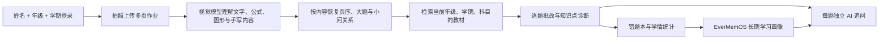
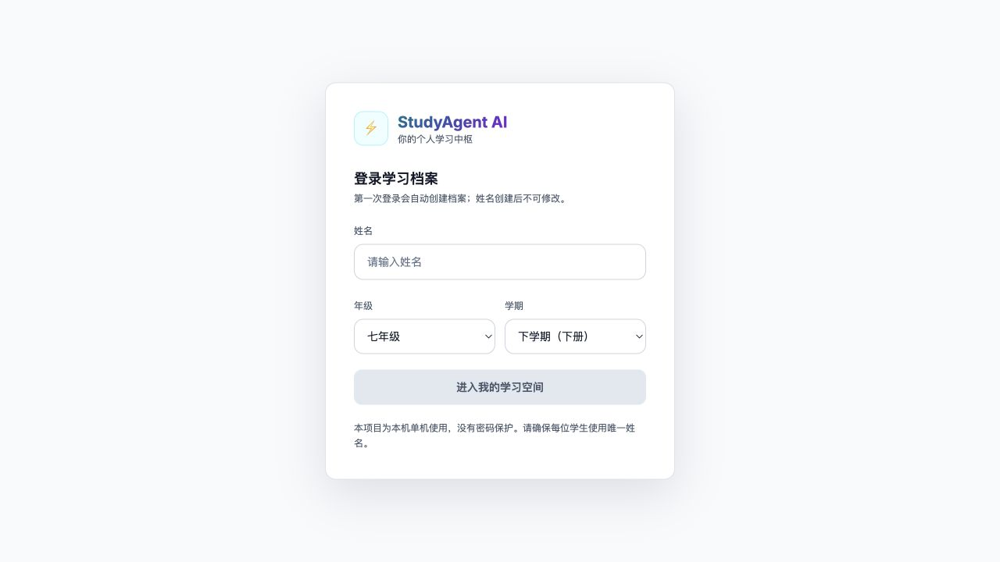
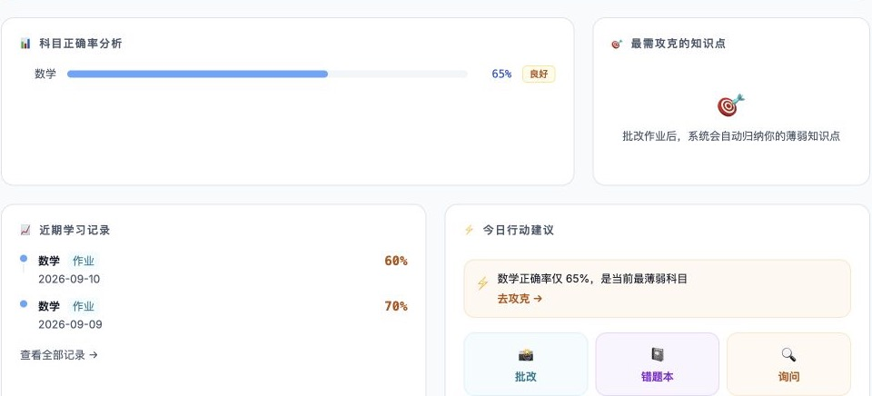
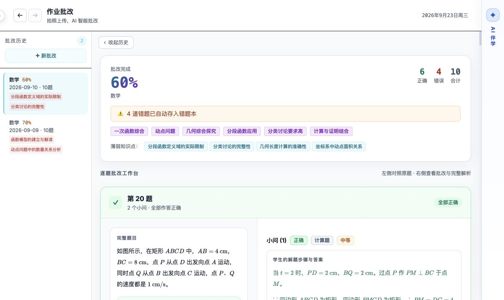
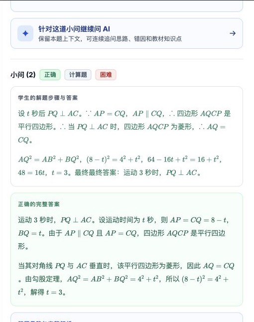
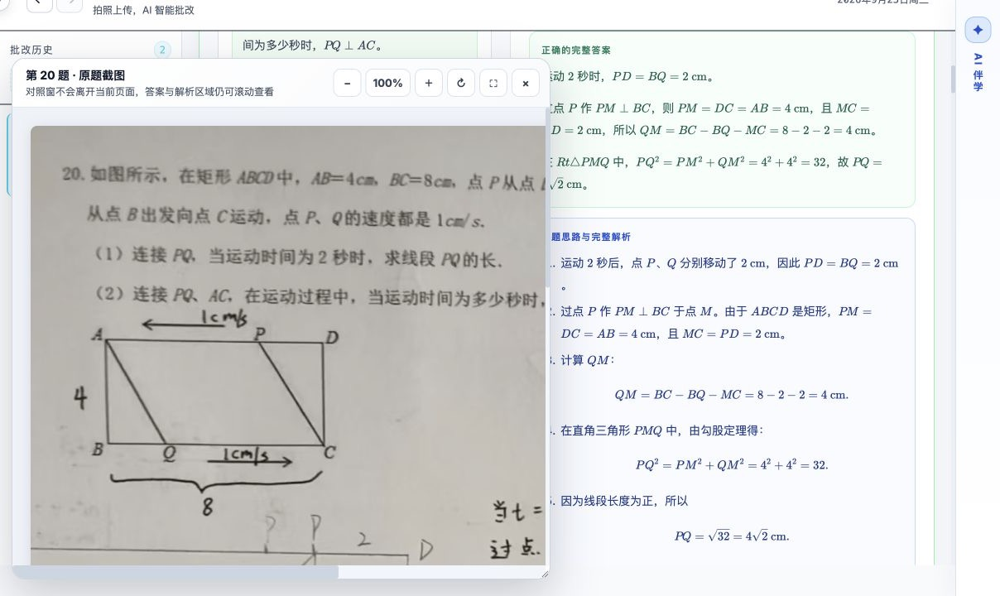
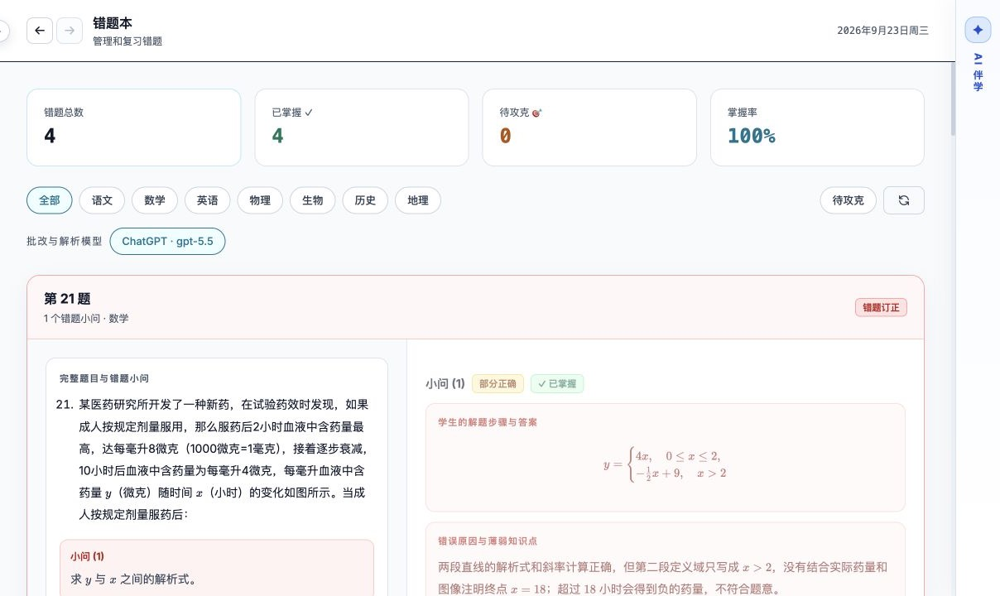
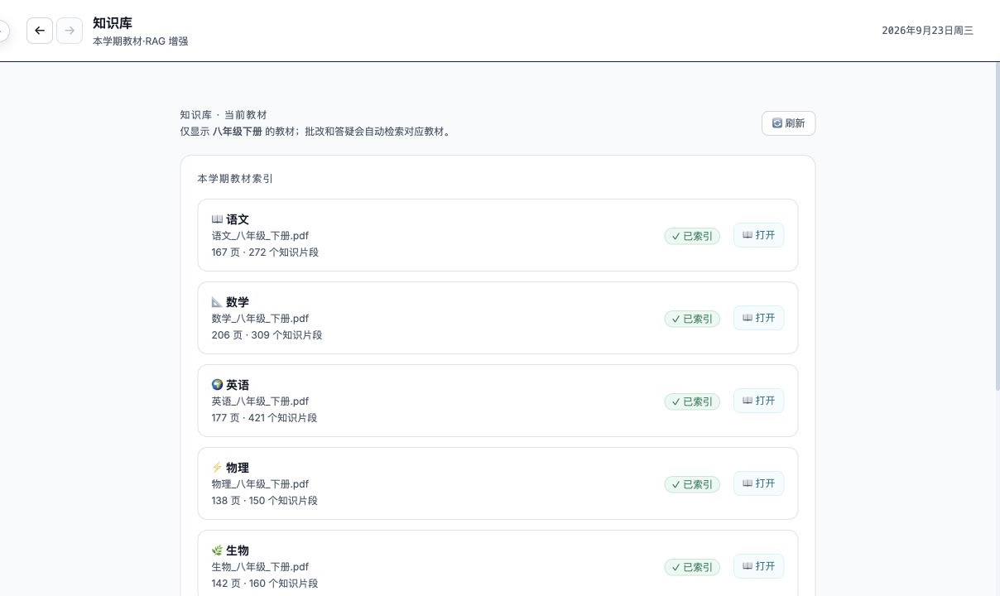
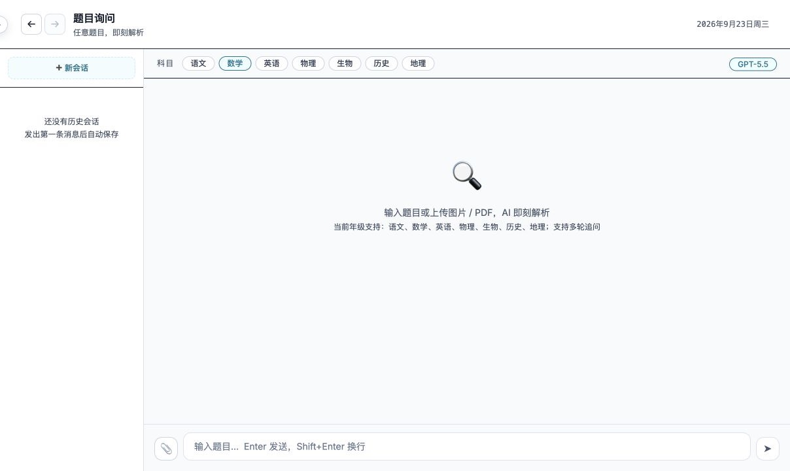

# StudyAgent AI

> 面向小学一年级至初中九年级的多模态个性化学习智能体：从作业拍照、教材检索、逐题批改，到错题沉淀、追问讲解和长期学习画像，形成一条完整的学习闭环。


学生只需要填写姓名、年级和学期即可进入系统。上传手机拍摄的作业后，StudyAgent AI 会理解题目中的文字、公式、图形和手写过程，自动恢复大题与小问结构，再检索当前学生正在使用的教材，给出有教材依据的批改结果。

它不是一个只返回“对/错”的识题工具。每道题都会保留完整题干、学生过程、正确答案、错误原因、教材依据、解题思路和原题截图；学生还可以在该题右侧直接继续追问，AI 会带着当前题目的上下文进行流式回答。

> 本页截图来自本地运行的真实功能与历史批改记录。为保护隐私，公开截图裁掉了学生姓名；用户数据、原始教材、作业源文件、向量库和 API 密钥均未提交到仓库。

## 一分钟了解产品



核心闭环：

1. **自动建档**：姓名唯一，首次登录即创建用户；后续可修改年级和学期，姓名保持不变。
2. **多模态批改**：直接理解手机照片，不依赖“纯 OCR 后再猜题”的单一路径。
3. **教材 RAG**：只检索当前年级、学期和科目对应的教材，避免跨年级、跨学科引用。
4. **结构化结果**：按照“大题 → 小问”组织批改，学生无需来回翻纸质作业。
5. **即时追问**：每道题拥有独立的 AI 对话入口，当前题目和批改结果自动成为上下文。
6. **长期记忆**：批改历史、薄弱知识点和学习偏好进入用户独立的学习画像。

## 真实产品体验

### 1. 无注册页登录，首次使用自动建档

登录严格使用“姓名 + 年级 + 学期”。系统目前定位为本机个人学习工具，因此不要求密码；同一个姓名再次登录会进入同一份学习档案。



登录后，主控制台聚合各科正确率、近期学习记录、最薄弱知识点和今日行动建议。它不只是展示统计数字，还会把薄弱科目直接连接到“批改、错题本、问 AI”等下一步操作。



### 2. 上传真实作业，恢复大题与小问结构

作业批改支持 JPG、JPEG、PNG、WEBP、GIF、HEIC 和 HEIF。一次可上传多页，模型会依据图片内容和题号关系恢复顺序，不依赖文件名决定页序。

批改结果首先给出整次作业的科目、正确率、对错题数、涉及知识点和薄弱点；下方按照原卷的大题号分组，小问不会脱离所属大题。



每个小问都保留以下内容：

- 完整题干及本小问要求；
- 学生自己的解题步骤与答案；
- AI 对本次作答判断的具体错误原因，而不是强行套入固定错误分类；
- 正确的完整答案与分步过程；
- 可直接阅读的数学公式；
- 对应教材的章节、页码与建议复习知识点；
- 解题思路和当前题目的独立 AI 追问入口。



### 3. 原题照片与解析同屏对照

学生点击“原题截图”后不会跳到新的浏览器标签页，而是在当前页面打开图片查看器。批改区与原图可以同屏对照，学生能够放大查看图形、手写步骤和老师圈画，同时继续阅读右侧解析。



### 4. 错题自动沉淀，不重复点击才能看解析

错题本只保留做错或部分正确的小问，并保持原有的大题归属和截图完整性。答案、错误原因、教材依据和思路默认展开，减少反复点击；学生可以标记“已掌握”，也可以继续针对这道错题问 AI。



### 5. 教材库自动跟随年级和学期

教材按照“年级 / 学期 / 科目”路由。以八年级下册为例，页面只展示该阶段实际开设的语文、数学、英语、物理、生物、历史和地理教材；每张卡片同时显示教材文件和当前向量索引状态。



当前教材范围遵循中小学实际开课关系：

| 学科 | 支持年级 |
| --- | --- |
| 语文、数学 | 一至九年级 |
| 英语 | 三至九年级 |
| 物理 | 八至九年级 |
| 生物、地理 | 七至八年级 |
| 历史 | 七至九年级 |
| 化学 | 九年级 |

上下学期分别对应上册和下册，共 70 本教材。公开仓库不分发教材 PDF；使用者需要按 `学科_年级_上册/下册.pdf` 的命名规则自行准备合法教材。

### 6. 独立 AI 问答与图片/PDF 辅助输入

除了逐题追问，还提供完整的“题目询问”页面。学生可以选择科目、输入问题，也可以上传图片或 PDF。模型固定读取后端配置，前端不提供随意切换模型的入口，避免误选不支持视觉理解的模型。



## Agent 如何完成一次批改

StudyAgent AI 把一次复杂批改拆成边界清晰的多个阶段。各阶段共享必要上下文，但不让单个 Agent 同时承担图片识别、教材检索、评分、画像更新和持久化等全部职责。

| 组件 | 职责 | 关键输出 |
| --- | --- | --- |
| `OcrAgent` | 直接查看原始图片，识别印刷文字、手写过程、公式、图形和题号关系 | 页面内容、题目结构、图片可识别性 |
| 教材检索层 | 使用当前用户的年级、学期和科目过滤 Qdrant，再进行相似度召回 | 教材片段、章节、页码、相关性分数 |
| `GradeAgent` | 联合原图、结构化识别结果和教材上下文逐题判断 | 对错、学生答案、正确答案、错误原因、完整解析 |
| `KnowPointAgent` | 从题目和批改结果提取知识点，并与历史薄弱点关联 | 知识点、难度、薄弱点命中情况 |
| `ExamTagAgent` | 识别作业/试卷的类型和内容标签 | 试卷标签、摘要信息 |
| `ExplainAgent` | 接收某一道题的完整上下文，进行多轮流式讲解 | 针对当前题目的个性化回答 |
| `WrongBookService` | 只归档错题和部分正确题，保存题目截图及结构化结果 | 可检索、可标记掌握的错题记录 |
| `EverMemOSService` | 将学习事实写入用户独立记忆空间，并在后续问答前检索 | 批改历史、薄弱点、学习偏好、会话摘要 |

实际数据链路：

```text
原始图片
  → 图片真实性/大小/像素校验
  → 多页并发视觉识别
  → 基于内容的页序与题号重组
  → 按用户年级/学期/科目检索教材
  → 逐题批改与结构化校验
  → 知识点诊断
  → 错题归档 + 长期记忆写入
  → 前端按大题/小问渲染 + 独立 AI 追问
```

## 教材 RAG：为什么需要 Qdrant

PDF 本身不能高质量地支持语义检索。项目先提取每页文字；扫描页可使用提前生成的 macOS Vision OCR 结果，再将内容按约 700 字、100 字重叠切分，用 `qwen3.7-text-embedding` 生成 1024 维向量并写入 Qdrant。

Qdrant 在这里负责：

- 持久化教材向量，不需要每次启动重新向量化；
- 使用 `grade + semester + subject + textbook_id` 做元数据过滤；
- 返回与当前题目最相关的教材片段及分数；
- 支持重建单科索引和检查每本教材的索引状态。

当前本地数据已验证 **70/70 本教材索引有效，共 13,643 个向量点**。这些数字是当前开发数据集的运行记录，不代表公开仓库内附带教材数据。

检索默认设置 `0.35` 的最低相关性阈值。没有足够相关的教材片段时，系统会明确按 `used_rag=false` 回退到模型通用知识，不伪造教材章节或页码。

## EverMemOS：跨会话的学生画像

普通对话模型不会自然记住学生一个月前在哪类题目上反复出错。StudyAgent AI 将每位用户映射到独立的 EverMemOS 用户空间，并在关键事件发生时写入结构化学习事实。

| 触发时机 | 写入内容 |
| --- | --- |
| 作业批改完成 | 科目、题数、正确率、薄弱知识点 |
| 错题产生 | 完整题目、学生作答、正确答案、具体错误原因 |
| 发现薄弱点 | 需要复习的知识点与原因 |
| AI 对话达到上下文上限 | 学生问题、讲解过程和结论摘要 |
| 用户修改设置 | 年级、学期与讲解偏好 |

后续批改时，`KnowPointAgent` 会判断新题是否命中历史薄弱区；后续问答时，`ExplainAgent` 会先检索相关学情，再决定解释深度和举例方式。姓名、数据目录和 EverMemOS 用户 ID 均绑定内部 UUID，避免仅凭展示名称拼接数据路径。

EverOS 1.2.3 当前主要提供 Episode、Atomic Fact 和 Profile 三类记忆。其 Foresight 提取策略默认关闭，因此本项目不把“主动预测未来行为”作为已交付能力宣传。

## 可靠性与安全边界

这个项目会接收真实学生图片并调用外部模型，因此不仅要“能跑”，还必须限制输入、隔离数据，并允许依赖失败时安全降级。

| 风险点 | 当前处理 |
| --- | --- |
| 伪装成图片的任意文件 | 使用 Pillow 真实解码并校验格式，不只相信扩展名和 MIME |
| 超大文件/解压炸弹 | 单张 20 MB、40MP 上限；流式读取后拒绝超限内容 |
| 一次上传过多页面 | 单次最多 12 页；OCR 默认串行，并可通过环境变量受控调整并发 |
| 题目数量失控 | 单页、整批题数和各文本字段均有限制与截断 |
| 提示词注入 | 学生内容和教材片段被标记为不可信数据，只允许作为分析材料 |
| 无关教材被强行引用 | 年级/学期/科目硬过滤 + 相关性阈值 + 无 RAG 回退 |
| 多用户数据串联 | 用户 UUID 隔离本地目录、错题、画像和 EverMemOS 空间 |
| 服务暴露到局域网 | Web、EverOS、Qdrant 均只绑定 `127.0.0.1` |
| 外部记忆服务暂时不可用 | 批改主流程继续运行，记忆能力降级并记录状态 |

当前认证模型是“本机可信环境下的身份选择”，不是互联网账户体系：没有密码、没有注册审核，同名用户不能创建第二份档案。若要部署到公网，必须新增密码或统一身份认证、HTTPS、权限模型、CSRF/速率限制、日志脱敏和正式的数据合规方案。

## 技术栈

| 层级 | 技术 |
| --- | --- |
| 前端 | Alpine.js、原生 HTML/CSS、KaTeX、PWA 配置 |
| API | Python 3.13、FastAPI、Pydantic、Uvicorn |
| 主模型 | OpenAI 兼容的视觉语言模型，当前配置为 GPT-5.5 |
| Embedding | `qwen3.7-text-embedding`，1024 维 |
| 教材向量库 | Qdrant（Docker、本机持久化） |
| 长期记忆 | EverOS / EverMemOS（Docker、本机持久化） |
| 业务数据 | SQLite + 分用户本地文件 |
| 公式渲染 | KaTeX，兼容模型返回的 LaTeX 行内/块级公式 |
| 测试 | Pytest，当前自动化回归 50 项通过 |

## 项目结构

```text
StudyAgent-AI/
├── src/
│   ├── api/
│   │   ├── main.py                 # FastAPI、中间件和路由注册
│   │   ├── run_server.py           # 本地启动入口
│   │   └── routers/                # 登录、批改、问答、错题本、教材等 API
│   ├── agents/
│   │   ├── homework/               # OCR → Grade → KnowPoint → ExamTag
│   │   ├── explain/                # 带题目上下文和历史记忆的问答 Agent
│   │   └── memory/                 # 学习画像与会话摘要
│   └── services/
│       ├── llm/                    # OpenAI 兼容模型调用
│       ├── embedding/              # Embedding 适配层
│       ├── rag/                    # 教材检索组件
│       ├── evermemos/              # 长期记忆客户端与业务层
│       └── textbook_vector_store.py
├── web/index.html                  # Alpine.js 单页应用
├── scripts/
│   ├── ocr_textbooks.py            # 扫描版教材 OCR
│   └── index_textbooks.py          # 教材向量化与断点续建
├── TextBook/                       # 教材目录；PDF 不进入公开仓库
├── data/                           # 用户数据、OCR 缓存和清单；不进入公开仓库
├── docs/screenshots/               # README 脱敏产品截图
├── config/                         # 全局与 Agent 配置
├── docker-compose.yml
├── requirements.txt
└── run.sh
```

## 快速启动

### 1. 环境要求

- macOS；
- Miniconda，项目约定环境路径为 `/opt/miniconda3/envs/studybuddy`；
- Docker Desktop，用于 Qdrant 和 EverOS；
- 支持图片输入的 OpenAI 兼容主模型接口；
- 千问兼容的 Embedding 接口。

### 2. 克隆并创建 Conda 环境

```bash
git clone https://github.com/szlstart/StudyAgent-AI.git
cd StudyAgent-AI

/opt/miniconda3/bin/conda create -y -p /opt/miniconda3/envs/studybuddy python=3.13
/opt/miniconda3/bin/conda activate /opt/miniconda3/envs/studybuddy
python -m pip install -r requirements.txt
```

本项目约定使用 Conda，不创建 `.venv`。

### 3. 配置 `.env`

在项目根目录新建 `.env`。不要把真实密钥提交到 GitHub。

```dotenv
# 主模型：必须支持图片输入
LLM_BINDING=openai
LLM_MODEL=gpt-5.5
LLM_API_KEY=sk-xxx
LLM_HOST=https://your-openai-compatible-endpoint/v1

# 教材向量模型
EMBEDDING_MODEL=qwen3.7-text-embedding
EMBEDDING_API_KEY=sk-xxx
EMBEDDING_HOST=https://your-embedding-compatible-endpoint/v1
EMBEDDING_DIMENSION=1024

# 本机服务
EVERMEMOS_BASE_URL=http://127.0.0.1:1995
QDRANT_URL=http://127.0.0.1:6333
BACKEND_HOST=127.0.0.1
BACKEND_PORT=8001
```

### 4. 启动本地数据库

```bash
docker compose up -d qdrant everos
docker compose ps
```

默认端口：

- StudyAgent AI：`127.0.0.1:8001`
- EverOS：`127.0.0.1:1995`
- Qdrant：`127.0.0.1:6333`

三者都只监听本机，不接受局域网连接。EverOS 与 Qdrant 数据分别持久化到 Docker 数据卷。

### 5. 准备并索引教材

教材 PDF 因版权和体积原因不随仓库发布。按照 [TextBook/README.md](TextBook/README.md) 的目录和命名规则放入合法教材后执行：

```bash
# 扫描版教材先进行 OCR，支持断点续跑
python scripts/ocr_textbooks.py

# 向量化并写入 Qdrant；已完成教材自动跳过
python scripts/index_textbooks.py
```

批量重建 70 本教材会消耗时间和 Embedding API 额度。不要在 Qdrant 未启动或密钥无效时重复执行。

### 6. 启动 Web 应用

```bash
./run.sh
```

`run.sh` 会检查并使用 `/opt/miniconda3/envs/studybuddy`。也可以在激活环境后直接运行：

```bash
python src/api/run_server.py
```

浏览器统一访问：

```text
http://localhost:8001/ui/
```

API 文档：

```text
http://localhost:8001/docs
```

## 主要 API

| 方法 | 路径 | 说明 |
| --- | --- | --- |
| `POST` | `/api/v1/auth/login` | 姓名 + 年级 + 学期登录，首次自动建档 |
| `PATCH` | `/api/v1/auth/profile` | 修改年级和学期，姓名不可修改 |
| `POST` | `/api/v1/homework/grade` | 上传多页作业并返回结构化批改结果 |
| `POST` | `/api/v1/explain` | 文字问题的流式 AI 问答 |
| `POST` | `/api/v1/explain/with-image` | 带图片的视觉题目解析 |
| `POST` | `/api/v1/explain/extract-from-file` | 提取图片或 PDF 内容 |
| `GET` | `/api/v1/wrong-book` | 获取当前用户错题列表 |
| `PUT` | `/api/v1/wrong-book/{entry_id}/mastered` | 标记或取消掌握错题 |
| `GET` | `/api/v1/profile` | 获取学情画像 |
| `PATCH` | `/api/v1/profile/preferences` | 修改讲解风格等学习偏好 |
| `GET` | `/api/v1/textbook/status` | 获取当前学期教材和索引状态 |
| `POST` | `/api/v1/textbook/reindex/{subject}` | 重建当前科目教材索引 |

## 测试与运行检查

```bash
# 自动化测试
/opt/miniconda3/envs/studybuddy/bin/python -m pytest -q

# 后端健康检查
curl http://localhost:8001/api/v1/health

# Docker 依赖状态
docker compose ps

# EverOS 健康检查
curl http://127.0.0.1:1995/health

# Qdrant 集合状态
curl http://127.0.0.1:6333/collections
```

自动化测试覆盖登录约束、图片校验、用户隔离、教材路由、批改结构恢复、公式规范化、错题归档、RAG 相关性与降级等关键路径。测试通过说明代码契约保持稳定，但不等同于模型对所有拍照、字迹和题型都具备 100% 识别准确率。

## 数据、隐私与公开仓库边界

以下内容必须只保存在本机，已经通过 `.gitignore` 排除：

- `.env` 和任何 API 密钥；
- `TextBook` 中的教材 PDF；
- 学生姓名、个人设置、作业照片、错题与对话记录；
- SQLite 数据库、OCR 缓存和索引清单；
- Qdrant 与 EverOS 的 Docker 数据卷；
- 日志、临时文件和本地备份。

主模型和 Embedding 模型均可能由外部 API 提供。即使业务数据库保存在本机，上传给模型的题目图片、文字和教材片段仍会进入对应服务商的处理链路；正式使用前应阅读服务商的数据政策，不要上传不必要的个人身份信息。

## 当前边界

- 只支持小学一年级至初中九年级，不支持高中课程。
- 登录没有密码保护，适合本机或可信设备，不适合直接公网部署。
- 模型准确度受照片清晰度、手写字迹、复杂图形、教材 OCR 质量和上游模型稳定性影响。
- 教材 RAG 能提供相关依据，但模型生成的答案仍应由学生或教师复核。
- PWA 配置仍然保留，但项目不开放局域网访问，因此不提供手机局域网安装入口。
- 外部模型、Embedding、Qdrant 或 EverOS 的健康状态会影响对应能力；核心流程对记忆服务失败提供降级，但无法在主模型不可用时完成批改。

## 更多文档

- [详细使用手册](使用手册.md)：学生操作、教材维护、备份恢复和故障排查。
- [项目审计与改进记录](项目审计与改进记录.md)：项目优点、已修复问题、剩余限制与验证证据。
- [严格安全与 Agent 质量审计报告](严格安全与Agent质量审计报告.md)：输入安全、用户隔离、Agent 合理性、RAG 和真实运行审计。
- [教材目录说明](TextBook/README.md)：教材命名、年级目录和索引准备规则。

## 演示视频

[查看 StudyAgent AI 操作演示](https://github.com/user-attachments/assets/eb99171f-246f-4a90-99e0-91e803813c4b)

---

如果你希望把它用于公网、多学校或教师班级场景，请先完成正式认证、权限体系、租户隔离、数据合规和模型评测；当前版本首先保证的是一台可信本机上的完整学习闭环。
